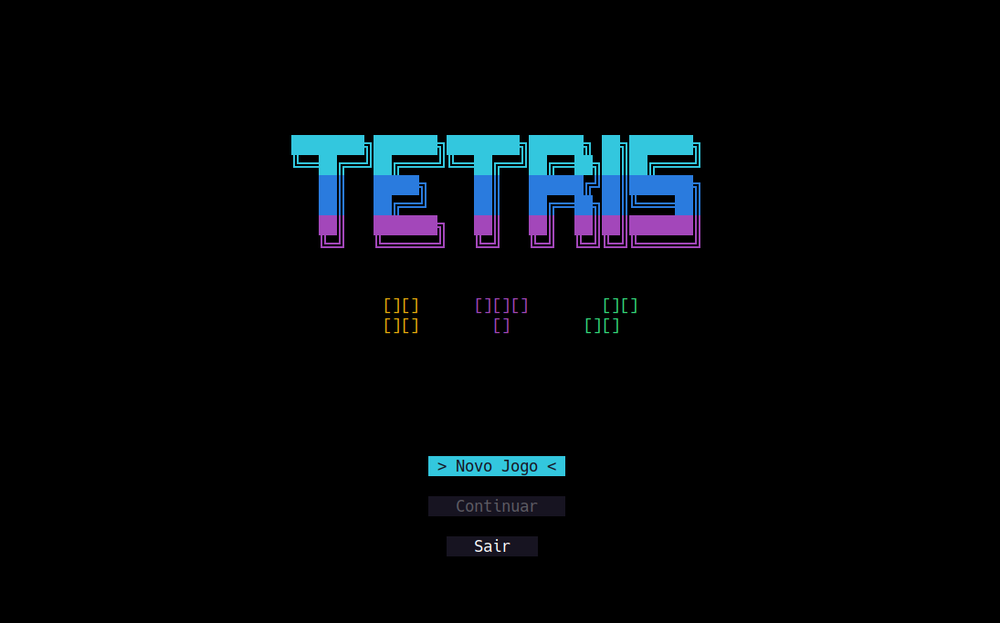

# Tetris Console Edition

A Tetris clone developed purely in **C# (Vanilla)** to run directly in the terminal. 

---


---

## Tech Stack


- **Language:** C# (Vanilla)
- **Platform:** .NET 8.0 Console Application
- **Architecture:** OOP (Object Oriented Programming) with Game Loop Pattern
- **Infrastructure:** Docker & Docker Compose

---

## How to Run

This game has been containerized to ensure that you can play it without having to install the .NET SDK on your machine.

### Prerequisites

- [Docker](https://www.docker.com/) installed and running.

### Running with Docker

1.  Open the terminal in the project's root folder.
2.  Build the game image:
    ```bash
    docker compose build
    ```
3.  Run the game:
    ```bash
    docker compose run --rm tetris-game
    ```

### Running Locally (.NET SDK)

If you have the .NET 10 SDK installed and prefer to run natively:

```bash
dotnet run
```